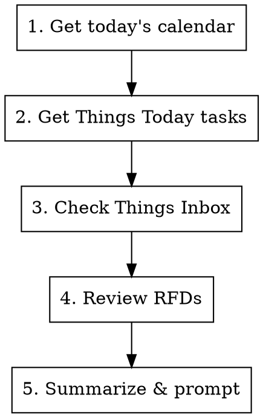

# Daily Startup

## Workflow



## Steps

1. **Calendar** - Fetch today's meetings via `icalbuddy`
2. **Things Today** - Get critical work tasks using `mcp__things__get_today`
3. **Things Inbox** - Surface items needing triage using `mcp__things__get_inbox`
4. **RFDs** - Check for RFDs needing review or action
5. **Summarize** - Present overview and offer to create daily note

## Output Format

Present a clean summary:

```
## Today's Focus

### Meetings
- 9:00 AM - Standup
- 2:00 PM - 1:1 with [[Person Name]]

### Critical Tasks
- [ ] Task from Things Today
- [ ] Another task

### Inbox (needs triage)
- Item 1
- Item 2

### RFDs to Review
- RFD-123: Title (awaiting review)
- RFD-456: Title (recently updated)

---
Ready to create daily note? (Daily/{date}.md)
```

## Daily Note

If user confirms, create `Daily/YYYY-MM-DD.md` in Obsidian vault with:
- Frontmatter with date and tags
- Meetings section pre-filled
- Space for daily log

## Tools Used

- `icalbuddy eventsToday` - calendar events
- `mcp__things__get_today` - today's tasks
- `mcp__things__get_inbox` - inbox items
- `mcp__unblocked__data_retrieval` or `mcp__unblocked__unblocked_context_engine` - find RFDs:
  - Recently updated RFDs that need attention
  - RFDs where Jake Huggart is mentioned (reviewer, author, or tagged)
