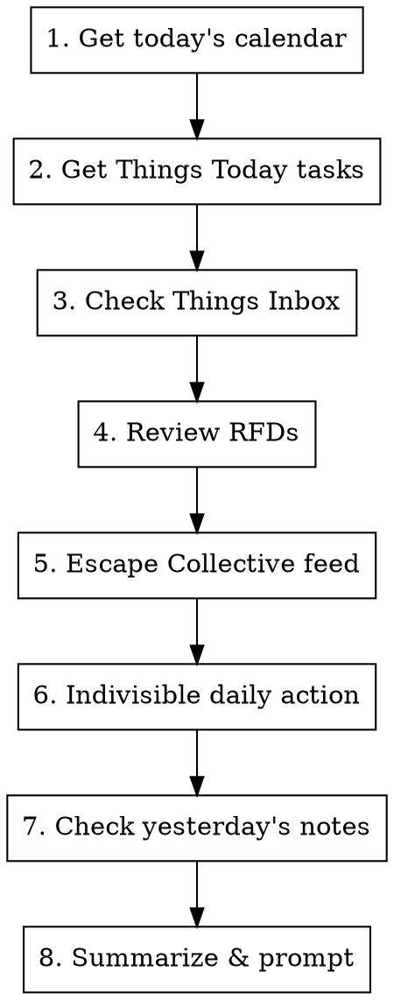

# Daily Startup

## Workflow


```dot
digraph daily {
    rankdir=TB;
    node [shape=box];

    "1. Get today's calendar" -> "2. Get Things Today tasks";
    "2. Get Things Today tasks" -> "3. Check Things Inbox";
    "3. Check Things Inbox" -> "4. Review RFDs";
    "4. Review RFDs" -> "5. Escape Collective feed";
    "5. Escape Collective feed" -> "6. Indivisible daily action";
    "6. Indivisible daily action" -> "7. Check yesterday's notes";
    "7. Check yesterday's notes" -> "8. Summarize & prompt";
}
```

## Steps

1. **Calendar** - Fetch today's meetings via `icalbuddy`
2. **Things Today** - Get critical work tasks using `mcp__things__get_today`
3. **Things Inbox** - Surface items needing triage using `mcp__things__get_inbox`
4. **RFDs** - Check for RFDs needing review or action
5. **Escape Collective** - Fetch latest unread articles from private RSS feed using WebFetch. Show title, author, and a one-line summary for each article
6. **Indivisible Daily Action** - Search Gmail for the most recent email from `action@birminghamindivisible.org`, read it, and summarize the action items
7. **Yesterday's Notes** - Prompt to ensure yesterday's notes have been transcribed
8. **Summarize** - Present overview and offer to create daily note

## Output Format

Present a clean summary:

```
## Today's Focus

### Meetings
- 9:00 AM - Standup
- 2:00 PM - 1:1 with [[Person Name]]

### Critical Tasks
- [ ] Task from Things Today
- [ ] Another task

### Inbox (needs triage)
- Item 1
- Item 2

### RFDs to Review
- RFD-123: Title (awaiting review)
- RFD-456: Title (recently updated)

### Escape Collective
- Article Title - Author - Brief summary
- Article Title - Author - Brief summary

### Indivisible Daily Action
- Action summary from latest email
- Key dates/deadlines
- Links to take action

### Yesterday's Notes
Have you transcribed yesterday's notes? (meetings, conversations, ideas)

---
Ready to create daily note? (Daily/{date}.md)
```

## Daily Note

If user confirms, create `Daily/YYYY-MM-DD.md` in Obsidian vault with:
- Frontmatter with date and tags
- Meetings section pre-filled
- Space for daily log

## Tools Used

- `icalbuddy eventsToday` - calendar events
- `mcp__things__get_today` - today's tasks
- `mcp__things__get_inbox` - inbox items
- `mcp__unblocked__data_retrieval` or `mcp__unblocked__unblocked_context_engine` - find RFDs:
  - Recently updated RFDs that need attention
  - RFDs where Jake Huggart is mentioned (reviewer, author, or tagged)
- `WebFetch` - fetch Escape Collective RSS feed:
  - URL: `https://member-rss.escapecollective.com/rss/feed?uuid=ef96ec96-9c08-485c-9e1e-688811640f8c&sig=62b605ab43021da235de819f30af78573d2410ec9855c43344883d9bf8f83b6a`
  - Parse XML to extract recent article titles, authors, and descriptions
  - Show articles not older than 3 days
- `mcp__claude_ai_Gmail__gmail_search_messages` - search for latest Indivisible action email:
  - Query: `from:action@birminghamindivisible.org` (most recent 1 result)
- `mcp__claude_ai_Gmail__gmail_read_message` - read the full email and extract:
  - Action items and calls to action
  - Key dates or deadlines
  - Links to take action
