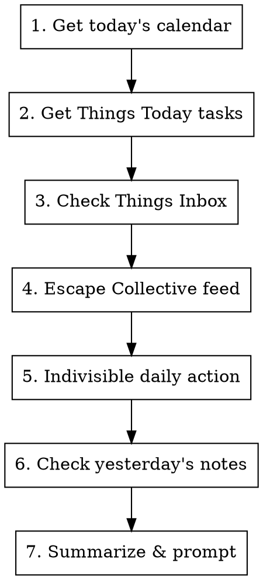

# Daily Startup

## Workflow



## Steps

1. **Calendar** - Fetch today's meetings via `icalbuddy`
2. **Things Today** - Get critical work tasks using `mcp__things__get_today`
3. **Things Inbox** - Surface items needing triage using `mcp__things__get_inbox`
4. **Escape Collective** - Read RSS feed URL from `~/.claude/secrets/escape-collective-rss-url`. If the file is missing or empty, prompt the user to create it (single line containing their personal feed URL) and skip this step. Otherwise fetch via WebFetch and show title, author, and a one-line summary per article
5. **Indivisible Daily Action** - Search Gmail threads for the most recent thread from `action@birminghamindivisible.org`, read it, and summarize the action items
6. **Yesterday's Notes** - Prompt to ensure yesterday's notes have been transcribed
7. **Summarize** - Present overview and offer to create daily note

## Output Format

Present a clean summary:

```
## Today's Focus

### Meetings
- 9:00 AM - Standup
- 2:00 PM - 1:1 with [[Person Name]]

### Critical Tasks
- [ ] Task from Things Today
- [ ] Another task

### Inbox (needs triage)
- Item 1
- Item 2

### Escape Collective
- Article Title - Author - Brief summary
- Article Title - Author - Brief summary

### Indivisible Daily Action
- Action summary from latest email
- Key dates/deadlines
- Links to take action

### Yesterday's Notes
Have you transcribed yesterday's notes? (meetings, conversations, ideas)

---
Ready to create daily note? (Daily/{date}.md)
```

## Daily Note

If user confirms, create `Daily/YYYY-MM-DD.md` in Obsidian vault with:
- Frontmatter with date and tags
- Meetings section pre-filled
- Space for daily log

## Tools Used

- `icalbuddy eventsToday` - calendar events
- `mcp__things__get_today` - today's tasks
- `mcp__things__get_inbox` - inbox items
- `WebFetch` - fetch Escape Collective RSS feed:
  - Read the feed URL from `~/.claude/secrets/escape-collective-rss-url` (a single line containing the full URL with auth params)
  - If the file is missing or empty, tell the user: "Create `~/.claude/secrets/escape-collective-rss-url` with your personal Escape Collective RSS URL (chmod 600), then re-run." Skip this step for now.
  - Parse XML to extract recent article titles, authors, and descriptions
  - Show articles not older than 3 days
- `mcp__claude_ai_Gmail__search_threads` - find latest Indivisible action thread:
  - Query: `from:action@birminghamindivisible.org` (most recent 1 result)
- `mcp__claude_ai_Gmail__get_thread` - read the full thread and extract:
  - Action items and calls to action
  - Key dates or deadlines
  - Links to take action
