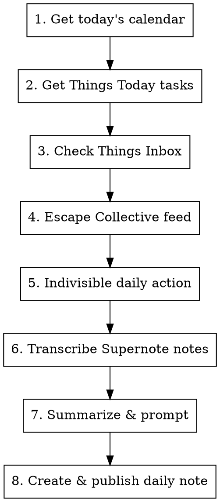

# Daily Startup

## Workflow



## Steps

1. **Calendar** - Fetch today's meetings via `icalbuddy`
2. **Things Today** - Get critical work tasks using `mcp__things__get_today`
3. **Things Inbox** - Surface items needing triage using `mcp__things__get_inbox`
4. **Escape Collective** - Read RSS feed URL from `~/.claude/secrets/escape-collective-rss-url`. If the file is missing or empty, prompt the user to create it (single line containing their personal feed URL) and skip this step. Otherwise fetch the feed with `curl` (the member feed returns HTTP 403 to WebFetch's crawler, so use `curl -s -A 'Mozilla/5.0' "$(cat ~/.claude/secrets/escape-collective-rss-url)"` and parse the XML). In the on-screen summary, show title, author, and a one-line summary per article. In the daily note, include title, author, a concise summary (a few sentences), and the full article URL as visible text so it can be opened from the tablet or Obsidian
5. **Indivisible Daily Action** - Search Gmail threads for the most recent thread from `action@birminghamindivisible.org`, read it, and summarize the action items
6. **Transcribe Supernote Notes** - Run `~/.claude/scripts/transcribe-supernote-notes.py` to turn new or updated Supernote notes (synced to the local Google Drive folder) into Markdown in `Daily/`. Output is named `YYYY-MM-DD-<folder>-notes.md` to match the daily notes — the date is the note's last edit, `<folder>` is the note's parent folder (which keeps same-date notes from different folders apart), and the note's name is appended when two notes in the same folder share a date. The script renders `.note` files to PDF via `supernotelib`, then noted.md (`notedmd`, transcribing with Gemini) handles them; PNG/JPG exports are transcribed directly. Source PDFs are skipped (publish-to-supernote's published daily-note PDFs sync into this same tree, and re-transcribing those would round-trip notes already in the vault). A note is (re)transcribed whenever its source is newer than the existing `.md` (overwriting it); ones already up to date are skipped. Report which notes were transcribed (source name + `Daily/YYYY-MM-DD-<folder>-notes.md`), then still prompt the user about anything the tablet hasn't synced yet. If the script reports a missing config or `notedmd` isn't set up, relay its instructions (see README one-time setup)
7. **Summarize** - Present overview and offer to create daily note
8. **Publish** - After the daily note is created, offer to publish it to the Supernote tablet

## Output Format

Present a clean summary:

```
## Today's Focus

### Meetings
- 9:00 AM - Standup
- 2:00 PM - 1:1 with [[Person Name]]

### Critical Tasks
- [ ] Task from Things Today
- [ ] Another task

### Inbox (needs triage)
- Item 1
- Item 2

### Escape Collective
- Article Title - Author - Brief summary
- Article Title - Author - Brief summary

### Indivisible Daily Action
- Action summary from latest email
- Key dates/deadlines
- Links to take action

### Supernote Notes
- Transcribed: Work/Meeting Notes.note → Daily/2026-05-31-Work-notes.md
- (or) No new notes to transcribe
Anything the tablet hasn't synced yet that you took on paper? (meetings, conversations, ideas)

---
Ready to create daily note? (Daily/{date}.md)
```

## Daily Note

If user confirms, create `Daily/YYYY-MM-DD.md` in the Obsidian vault
(`/Users/jake/Library/Mobile Documents/iCloud~md~obsidian/Documents/Obsidian/Daily/`)
following the Output Format structure, with the Escape Collective section
expanded to a concise summary and visible article URL per item:
- Frontmatter with date and tags
- Meetings section pre-filled
- Critical Tasks and Inbox sections
- Escape Collective section - each article's title, author, a concise summary, and the article URL as visible text
- Indivisible Daily Action summary
- Space for a daily log

## Publish to Supernote

After the note is created, ask: "Publish today's note to your Supernote? [y/N]"
If the user confirms, run:

```
~/.claude/scripts/publish-to-supernote.py "<path to the daily note just created>"
```

The script converts the note to PDF (via `pandoc`/`typst`) and uploads it to
the Google Drive folder the Supernote syncs; the tablet picks it up on its next
sync. Its input is the Obsidian note file itself, so the tablet PDF is a
faithful mirror of the Obsidian note.

Credentials are read from `~/.claude/secrets/gdrive-supernote.env` (the four
`GDRIVE_*` values from the NAS ebook-sync `.env`). If that file is missing or
the token is rejected, the script prints what to do; relay it to the user.

## Tools Used

- `icalbuddy eventsToday` - calendar events
- `mcp__things__get_today` - today's tasks
- `mcp__things__get_inbox` - inbox items
- `curl` - fetch Escape Collective RSS feed (WebFetch gets a 403 from the member feed, so use curl):
  - Read the feed URL from `~/.claude/secrets/escape-collective-rss-url` (a single line containing the full URL with auth params)
  - If the file is missing or empty, tell the user: "Create `~/.claude/secrets/escape-collective-rss-url` with your personal Escape Collective RSS URL (chmod 600), then re-run." Skip this step for now.
  - Fetch with a browser User-Agent: `curl -s -A 'Mozilla/5.0' "$(cat ~/.claude/secrets/escape-collective-rss-url)"`
  - Parse XML to extract recent article titles, authors (`dc:creator`), summaries, and links
  - Show articles not older than 3 days
  - In the daily note, render each article as title + author, a concise summary, and the article URL shown as visible text (e.g. `Read: https://escapecollective.com/...`) so the link stays reachable from the Supernote PDF
- `~/.claude/scripts/transcribe-supernote-notes.py` - transcribe new Supernote notes into `Daily/` Markdown:
  - Reads the local Supernote folder path from `~/.claude/secrets/supernote-notes-dir` (a single line; the Google Drive for Desktop path the tablet syncs to)
  - If that file is missing or empty, relay the script's message: "Create `~/.claude/secrets/supernote-notes-dir` with the local Supernote folder path (chmod 600), then re-run." Skip this step for now.
  - Renders `.note` files to PDF via `supernotelib`, then runs `notedmd convert` (noted.md, transcribing with Gemini) to produce Markdown; PNG/JPG are transcribed directly. Source PDFs are skipped (they include publish-to-supernote's round-tripped daily-note PDFs)
  - Names output `Daily/YYYY-MM-DD-<folder>-notes.md` (date = the note's last-modified day, `<folder>` = its parent folder; the note name is appended when two notes in the same folder share a date), matching the vault's daily notes
  - (Re)transcribes when the source is newer than its `.md` and overwrites it; skips notes already up to date. Writes atomically, so a failed run leaves any existing `.md` intact
  - Requires a one-time `notedmd` setup (Homebrew install + `notedmd config`); see README. If the script reports `notedmd` is missing or unconfigured, relay its instructions
- `mcp__claude_ai_Gmail__search_threads` - find latest Indivisible action thread:
  - Query: `from:action@birminghamindivisible.org` (most recent 1 result)
- `mcp__claude_ai_Gmail__get_thread` - read the full thread and extract:
  - Action items and calls to action
  - Key dates or deadlines
  - Links to take action
- `~/.claude/scripts/publish-to-supernote.py` - publish the daily note to the Supernote tablet:
  - Pass the daily note's full path as the argument
  - Converts the note to PDF via `pandoc`/`typst` and uploads it to the Google Drive folder the Supernote syncs (the same folder ebook-sync delivers books to)
  - Reads Drive credentials from `~/.claude/secrets/gdrive-supernote.env`; the script prints setup instructions if that file is missing
