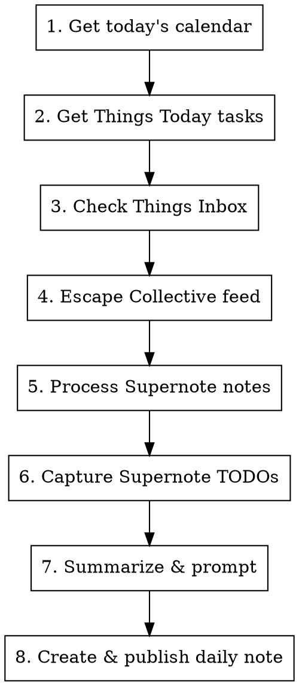

# Daily Startup

## Workflow


```dot
digraph daily {
    rankdir=TB;
    node [shape=box];

    "1. Get today's calendar" -> "2. Get Things Today tasks";
    "2. Get Things Today tasks" -> "3. Check Things Inbox";
    "3. Check Things Inbox" -> "4. Escape Collective feed";
    "4. Escape Collective feed" -> "5. Process Supernote notes";
    "5. Process Supernote notes" -> "6. Capture Supernote TODOs";
    "6. Capture Supernote TODOs" -> "7. Summarize & prompt";
    "7. Summarize & prompt" -> "8. Create & publish daily note";
}
```

## Steps

1. **Calendar** - Fetch today's meetings via `icalbuddy`
2. **Things Today** - Get critical work tasks using `mcp__things__get_today`
3. **Things Inbox** - Surface items needing triage using `mcp__things__get_inbox`
4. **Escape Collective** - Read RSS feed URL from `~/.claude/secrets/escape-collective-rss-url`. If the file is missing or empty, prompt the user to create it (single line containing their personal feed URL) and skip this step. Otherwise fetch the feed with `curl` (the member feed returns HTTP 403 to WebFetch's crawler, so use `curl -s -A 'Mozilla/5.0' "$(cat ~/.claude/secrets/escape-collective-rss-url)"` and parse the XML). In the on-screen summary, show title, author, and a one-line summary per article. In the daily note, include title, author, a concise summary (a few sentences), and the full article URL as visible text so it can be opened from the tablet or Obsidian
5. **Process Supernote Notes** - Invoke the `process-supernote` skill. It turns new and updated Supernote notes into Markdown in `Daily/`, processing only what changed since the last run, and reports each combined file with the notes that fed it (e.g. `Daily/2026-06-24-DevClarity-notes.md (from 20260624_090025.note, Todos.note)`). Carry that list into step 6 and into the summary's Supernote Notes section. If the skill reports a missing config or that `notedmd` isn't set up, relay its instructions and move on. Then still prompt the user about anything the tablet hasn't synced yet
6. **Capture Supernote TODOs** - Scan each markdown file the `process-supernote` skill reported as transcribed in step 5 (its `Transcribed:` list — not files it reported as already up to date) for lines containing `#todo` or `TODO:` (case-insensitive match on the marker). For each matching line, strip the marker and any leading whitespace/punctuation to extract the task title, then add it to the Things inbox via `mcp__things__add_todo`. If no todos are found, note that. Report each captured item with the source note file and the task text sent to Things. (Scanning only newly-transcribed files prevents duplicate todos on subsequent daily runs.)
7. **Summarize** - Present overview and offer to create daily note
8. **Publish** - After the daily note is created, automatically publish it to the Supernote tablet (no prompt)

## Output Format

Present a clean summary:

```
## Today's Focus

### Meetings
- 9:00 AM - Standup
- 2:00 PM - 1:1 with [[Person Name]]

### Critical Tasks
- [ ] Task from Things Today
- [ ] Another task

### Inbox (needs triage)
- Item 1
- Item 2

### Escape Collective
- Article Title - Author - Brief summary
- Article Title - Author - Brief summary

### Supernote Notes
- Transcribed: Daily/2026-06-24-DevClarity-notes.md (from 20260624_090025.note, Todos.note)
- (or) No new notes to transcribe
Anything the tablet hasn't synced yet that you took on paper? (meetings, conversations, ideas)

### Supernote TODOs → Things Inbox
- Added: "Review quarterly goals" (from Daily/2026-06-08-Note-notes.md)
- (or) No todos found in today's notes

---
Ready to create daily note? (Daily/{date}.md)
```

## Daily Note

If user confirms, create `Daily/YYYY-MM-DD.md` in the Obsidian vault. Read the
vault's `Daily/` path from `~/.claude/secrets/obsidian-daily-dir` — don't assume
an iCloud container, since Obsidian uses different ones depending on how the
vault was created. Follow the Output Format structure, with the Escape Collective section
expanded to a concise summary and visible article URL per item:
- Frontmatter with date and tags
- Meetings section pre-filled
- Critical Tasks and Inbox sections
- Escape Collective section - each article's title, author, a concise summary, and the article URL as visible text
- Space for a daily log

## Publish to Supernote

After the note is created, automatically publish it (no prompt) by running:

```
~/.claude/scripts/publish-to-supernote.py "<path to the daily note just created>"
```

The script converts the note to PDF (via `pandoc`/`typst`) and uploads it to
the Google Drive folder the Supernote syncs; the tablet picks it up on its next
sync. Its input is the Obsidian note file itself, so the tablet PDF is a
faithful mirror of the Obsidian note.

Credentials are read from `~/.claude/secrets/gdrive-supernote.env` (the four
`GDRIVE_*` values from the NAS ebook-sync `.env`). If that file is missing or
the token is rejected, the script prints what to do; relay it to the user.

## Tools Used

- `icalbuddy eventsToday` - calendar events
- `mcp__things__get_today` - today's tasks
- `mcp__things__get_inbox` - inbox items
- `curl` - fetch Escape Collective RSS feed (WebFetch gets a 403 from the member feed, so use curl):
  - Read the feed URL from `~/.claude/secrets/escape-collective-rss-url` (a single line containing the full URL with auth params)
  - If the file is missing or empty, tell the user: "Create `~/.claude/secrets/escape-collective-rss-url` with your personal Escape Collective RSS URL (chmod 600), then re-run." Skip this step for now.
  - Fetch with a browser User-Agent: `curl -s -A 'Mozilla/5.0' "$(cat ~/.claude/secrets/escape-collective-rss-url)"`
  - Parse XML to extract recent article titles, authors (`dc:creator`), summaries, and links
  - Show articles not older than 3 days
  - In the daily note, render each article as title + author, a concise summary, and the article URL shown as visible text (e.g. `Read: https://escapecollective.com/...`) so the link stays reachable from the Supernote PDF
- `process-supernote` skill - transcribes new and updated Supernote notes into `Daily/` Markdown:
  - Invoke it rather than calling `transcribe-supernote-notes.py` directly; the skill owns the prerequisites, the failure messages to relay, and the output contract
  - Processes only notes that changed since the last run, and reports each combined file with the notes that fed it — that list is what step 6 scans
- `mcp__things__add_todo` - add a captured todo to the Things inbox:
  - Called once per matching line found in step 6
  - Pass the extracted task text as the `title` parameter
  - No list/project needed — defaults to inbox
- `~/.claude/scripts/publish-to-supernote.py` - publish the daily note to the Supernote tablet:
  - Pass the daily note's full path as the argument
  - Converts the note to PDF via `pandoc`/`typst` and uploads it to the Google Drive folder the Supernote syncs (the same folder ebook-sync delivers books to)
  - Reads Drive credentials from `~/.claude/secrets/gdrive-supernote.env`; the script prints setup instructions if that file is missing
