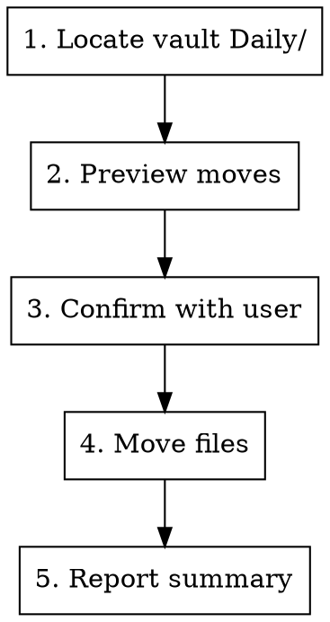

# Organize Daily Notes

Files daily notes from the flat `Daily/` root into year/month subfolders,
keeping the **current month** flat for quick access.

## Layout

- Daily notes are named `YYYY-MM-DD.md`. Obsidian's daily-notes plugin creates
  them flat in the vault's `Daily/` folder.
- Archived notes live in `Daily/YYYY/MM-Monthname/` — e.g.
  `Daily/2025/03-March/2025-03-12.md`.
- Month folders are a zero-padded number + English month name:
  `01-January` … `12-December`.

## Workflow



Run the commands below from the **Obsidian vault root** (the directory that
contains `Daily/`, `Areas/`, `Projects/`, …).

### 1. Preview

Show the user exactly what would move, grouped by destination. Move nothing yet.

```bash
cur=$(date +%Y-%m)
n=0
for f in Daily/[0-9][0-9][0-9][0-9]-[0-9][0-9]-[0-9][0-9].md; do
  [ -e "$f" ] || continue
  base=$(basename "$f" .md)
  [ "${base%-*}" = "$cur" ] && continue          # keep current month flat
  year=${base%%-*}
  folder=$(date -j -f "%Y-%m-%d" "$base" "+%m-%B" 2>/dev/null) || continue
  echo "$f  ->  Daily/$year/$folder/"
  n=$((n+1))
done
echo "$n file(s) would move."
```

### 2. Confirm

Show the preview output and ask the user to confirm before moving anything.
If `0 file(s) would move`, report that the root is already tidy and stop.

### 3. Move

On confirmation, run the same loop with the move applied:

```bash
cur=$(date +%Y-%m)
n=0
for f in Daily/[0-9][0-9][0-9][0-9]-[0-9][0-9]-[0-9][0-9].md; do
  [ -e "$f" ] || continue
  base=$(basename "$f" .md)
  [ "${base%-*}" = "$cur" ] && continue
  year=${base%%-*}
  folder=$(date -j -f "%Y-%m-%d" "$base" "+%m-%B" 2>/dev/null) || continue
  mkdir -p "Daily/$year/$folder"
  mv "$f" "Daily/$year/$folder/"
  echo "moved $f -> Daily/$year/$folder/"
  n=$((n+1))
done
echo "Moved $n file(s)."
```

### 4. Report

Summarize how many notes moved and into which `YYYY/MM-Monthname` folders.

## Notes

- The glob `[0-9][0-9][0-9][0-9]-[0-9][0-9]-[0-9][0-9].md` only matches
  `YYYY-MM-DD.md` files directly in `Daily/` — it skips `Daily/CLAUDE.md` and
  the `YYYY/` subfolders by construction.
- Obsidian wiki-links resolve by filename, so moving a note never breaks
  `[[2026-01-05]]` links — no link rewriting needed.
- Idempotent: re-running only acts on whatever is currently flat in `Daily/`.
- `date -j` is the macOS form of `date`; this skill targets a macOS setup.
