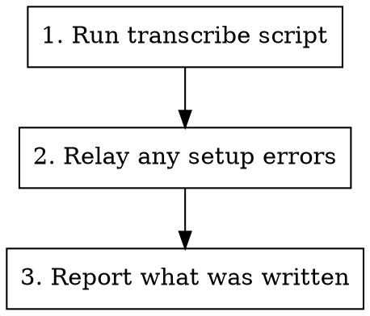

# Process Supernote Notes

Turn new and updated handwritten Supernote notes into Markdown in the Obsidian
vault's `Daily/` folder. Runs on demand, and is the step the `daily` skill
delegates its Supernote transcription to.

Only notes that changed since the last run are processed — see
[What "changed" means](#what-changed-means).

## Workflow



## Steps

1. **Run the script** - `~/.claude/scripts/transcribe-supernote-notes.py`, with no
   arguments. It resolves the local Supernote folder and the vault `Daily/`
   destination itself. A first-time backfill takes a few minutes (see
   [Rate limits](#rate-limits)) — let it finish rather than interrupting it
2. **Relay any setup errors** - if the script exits with a config or dependency
   error, pass its message on to the user verbatim and stop; see
   [When it fails](#when-it-fails). Don't try to work around a missing config by
   guessing paths
3. **Report what was written** - list each combined file and the notes that fed
   it, per the [Output contract](#output-contract) below

## What "changed" means

Notes are grouped into one output file per (date, folder), and a group is
re-transcribed whenever any note in it has an mtime newer than the existing
`.md` — so re-running is cheap and safe, and only touched notes cost API calls.

There is deliberately **no last-run timestamp file**. The per-file mtime check
self-heals: if a run dies halfway, the groups it never got to are still stale and
get picked up next time, where a single run-timestamp would have skipped them.

Editing a transcription by hand in Obsidian and then adding to that same day's
notes on the tablet **overwrites your edits** — the whole group is rebuilt.

## Output contract

Report the script's results in this shape. The `daily` skill's TODO-capture step
consumes the "Transcribed" list, so keep the file paths intact:

```
### Supernote Notes
- Transcribed: Daily/2026-06-24-DevClarity-notes.md (from 20260624_090025.note, Todos.note)
- Transcribed: Daily/2026-06-25-Home-notes.md (from 20260625_073000.note)
- 12 files already up to date
- (or) No new notes to transcribe
```

Mention failures explicitly — the script exits 1 if any note failed to
transcribe, and writes an inline `> [!warning]` block into that note's section.
A file whose notes *all* failed is left untouched rather than clobbered.

## What the script does

- Walks the local Supernote folder (Google Drive for Desktop mirrors the tablet's
  sync target) for `.note`, `.png`, `.jpg`, `.jpeg`
- Renders `.note` files to PDF via `supernotelib`, then transcribes with
  `notedmd` (noted.md, driving Gemini); images go to `notedmd` directly
- **Skips source PDFs on purpose** — `publish-to-supernote.py` drops published
  daily-note PDFs into this same tree, and transcribing those would round-trip
  notes already in the vault
- Combines all notes sharing a date and folder into one
  `Daily/YYYY-MM-DD-<folder>-notes.md`, each note a `## HH:MM` section (its file
  name when no time is known) in chronological order
- Dates a note by **its own date, not its mtime**: the `.note`'s embedded
  `FILE_ID`, falling back to a `YYYYMMDD` stamp in the file name, then mtime.
  Google Drive sets mtime to the sync time, which can trail the real date by days
- Writes YAML frontmatter: `creation date` (earliest note's time),
  `tags: [[supernote]] <year>`, `source` (every note that fed the file)
- Writes atomically — a failed run never clobbers an existing `.md`

## Rate limits

`notedmd` makes one Gemini request per note. The free tier caps
`gemini-2.5-flash` at ~10 requests/minute; past that the API returns 429 and
notedmd silently drops the note (exit 0, no output). The script therefore paces
calls ~7s apart and retries any that come back empty, so a backlog of 30+ notes
takes several minutes. Tune with `SUPERNOTE_MIN_CALL_INTERVAL`,
`SUPERNOTE_MAX_RETRIES`, `SUPERNOTE_RETRY_BACKOFF`.

## When it fails

| Script says | Relay to the user |
|-------------|-------------------|
| `missing ~/.claude/secrets/supernote-notes-dir` | Create it (`chmod 600`) with a single line: the local Google Drive for Desktop path to the tablet's notes folder, e.g. `~/Library/CloudStorage/GoogleDrive-you@example.com/My Drive/Supernote/Note` |
| `notedmd is not installed` | Run `setup.sh` (`brew install notedmd`), then configure a provider once |
| `source folder not found` | Google Drive for Desktop isn't running or isn't signed in — the mirrored folder is absent |
| `destination folder not found` | The Obsidian vault `Daily/` folder is missing or iCloud hasn't synced it |
| Every note fails to transcribe | Usually an unconfigured or rejected API key — check `notedmd config --show` |

**notedmd provider setup** (one-time): `notedmd config --edit`, choose the
**OpenAI-compatible** provider, URL
`https://generativelanguage.googleapis.com/v1beta/openai`, model
`gemini-2.5-flash`, and a free [Google AI Studio](https://aistudio.google.com/apikey)
API key. Config lives at
`~/Library/Application Support/com.company.notedmd/config.toml`.

Don't use notedmd's built-in **Gemini** provider or `--set-api-key`: that path
hardcodes the `gemma-3-27b-it` model, which the public Gemini API rejects with a
404.

## Tools Used

- `~/.claude/scripts/transcribe-supernote-notes.py` - the whole job; run with no
  arguments. Reads the source folder from `~/.claude/secrets/supernote-notes-dir`,
  writes to the vault's `Daily/`. Run via `uv`, which resolves `supernotelib`
  itself. Optional positional overrides: `[source-dir] [dest-dir]`

## Related

- `daily` - delegates its Supernote transcription step here, then scans the
  newly-written files for `#todo` / `TODO:` lines and files them into Things
